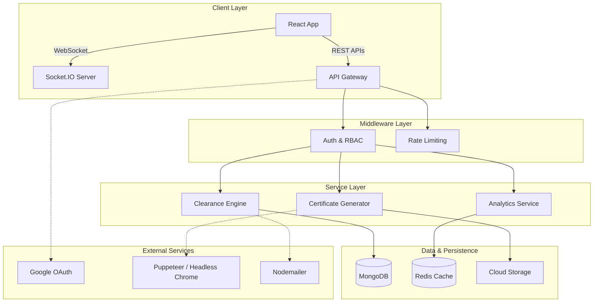
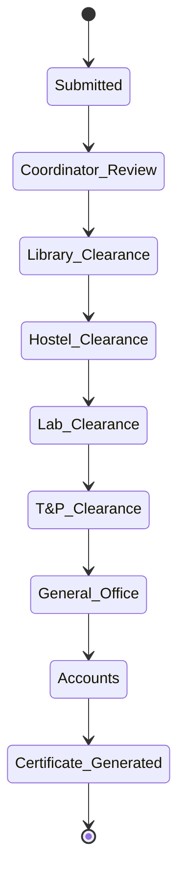

<div align="center">

# 🎓 MITS NbN Portal: Campus Operating System


**The Official Centralized Administrative Portal for Madhav Institute of Technology & Science (MITS)**

[](https://reactjs.org/)
[](https://nodejs.org/)
[](https://mongodb.com/)
[](https://redis.io/)
[](https://tailwindcss.com/)


## 🚀 Live Demo

<div align="center">

[](https://nbn.mitsgwalior.in)

</div>

---

</div>

<div>

## 📋 Table of Contents

- [🌟 Project Overview](#-project-overview)
- [🎯 Key Features](#-key-features)
- [🏗️ System Architecture](#️-system-architecture)
- [🛠️ Tech Stack](#️-tech-stack)
- [👥 User Roles & RBAC](#-user-roles--rbac)
- [🚀 Quick Start](#-quick-start)
- [📦 Installation](#-installation)
- [🔧 Configuration](#-configuration)
- [🔐 Security Features](#-security-features)
- [📈 Analytics & Reporting](#-analytics--reporting)
- [👨‍💻 Developer](#-developer)

---
</div>

## 🌟 Project Overview

<div align="center">

**MITS One-Desk** is a mission-critical, enterprise-grade application that revolutionizes campus administration by digitizing the entire lifecycle of student clearances, certifications, and institutional analytics.

### 🎯 Mission
> *"Replacing fragmented, paper-based processes with a high-performance, real-time digital ecosystem built on modern web technologies."*

</div>

### 📊 **What does One-Desk Manage?**

- **📄 Document Management** - Multi-stage approval workflows for NOC, No-Dues, and Bonafide Certificates
- **🎓 Alumni Services** - Post-graduation requests, document management, and exit surveys
- **🏢 Placement Integration** - Company directory, offer letter verification, and internship domains
- **📊 Advanced Analytics** - Real-time statistics, department-wise metrics, and performance reporting

---

## 🎯 Key Features

<div>

### 🎓 **Student & Administrative Services**
- **📄 Automated Clearances** - 6-stage sequential multi-department approval pipeline for No-Dues
- **📜 Instant Certificates** - Dynamic PDF generation with tamper-proof QR code verification
- **💼 NOC Management** - Conditional routing and multi-stage verification from T&P Office to HOD
- **👥 Batch Management** - Student grouping, progression tracking, and mass communications

### ⚡ **Real-Time Ecosystem**
- **🔄 Instant Sync** - WebSocket-powered live status tracking across all dashboards
- **🔔 Notification Engine** - Automated email alerts and in-app notifications
- **🚀 High Availability** - Redis caching layer for near-instant dashboard rendering

### 📊 **Enterprise Analytics**
- **📈 Department Dashboards** - Visualize request volumes, completion rates, and bottlenecks
- **📋 Placement Stats** - Track internship distribution, tier-based companies, and domains
- **📑 Custom Reports** - Export data in multiple formats for accreditation and auditing

### 🔐 **Advanced Security**
- **🔑 SSO Integration** - Secure Google OAuth 2.0 with domain restriction
- **🛡️ RBAC Authorization** - 10+ distinct user roles with fine-grained permission control
- **🔒 Document Security** - Encrypted cloud storage, virus scanning, and unique certificate hashes

</div>

---

## 🏗️ System Architecture

<div align="center">

### 🎯 **Distributed Architecture**



### 🔄 **Multi-Stage Approval Pipeline (No-Dues)**



</div>

---

## 🛠️ Tech Stack

<div align="center">

### 🎨 **Frontend Technologies**

| Technology | Purpose | Badge |
|------------|---------|-------|
| **React** | UI Framework |  |
| **Vite** | Build Tool |  |
| **Tailwind CSS** | Styling |  |
| **Framer Motion**| Animations |  |
| **Socket.IO** | Real-time |  |

### ⚙️ **Backend Technologies**

| Technology | Purpose | Badge |
|------------|---------|-------|
| **Node.js** | Runtime |  |
| **Express.js**| Framework |  |
| **MongoDB** | Database |  |
| **Redis** | Cache Layer |  |
| **Puppeteer** | PDF Gen |  |

</div>

---

## 👥 User Roles & RBAC

<div align="center">

### 🔐 **Granular Access Control**

| Role | Core Responsibilities | Access Level |
|------|-----------------------|--------------|
| **👨‍🎓 Student** | Submit requests, download certificates, exit surveys | Limited |
| **👨‍🏫 HOD** | Approve department requests, view analytics | Departmental |
| **📋 Coordinator** | Screen batch requests, manage students | Batch Level |
| **💼 T&P Office** | Manage NOCs, placements, company directories | Departmental |
| **🏫 Library/Hostel/Lab** | Verify specific clearances in the No-Dues pipeline | Specialized |
| **💰 Accounts** | Final financial clearance | Specialized |
| **👨‍💼 Admin/Registrar** | Full system configuration, global analytics | Complete |

</div>

---

## 🚀 Quick Start

<div align="center">

### ⚡ **One-Command Setup**

```bash
# Clone the repository
git clone https://github.com/Amit-akm-22/MITS-One-Desk.git
cd MITS-One-Desk

# Install dependencies and start development servers
npm install
npm run dev
```

</div>

---

## 📦 Installation

### 📋 **Step-by-Step Installation**

#### 1. **Clone Repository**
```bash
git clone https://github.com/Amit-akm-22/MITS-One-Desk.git
cd MITS-One-Desk
```

#### 2. **Install Dependencies**
```bash
# Backend
cd backend
npm install

# Frontend
cd ../frontend
npm install
```

#### 3. **Environment Configuration**
Create `.env` in the `backend` and `frontend` directories based on the configuration guide below.

#### 4. **Database & Cache**
```bash
# Ensure MongoDB is running
mongod

# Ensure Redis is running
redis-server
```

#### 5. **Start Application**
```bash
# Terminal 1: Backend
cd backend
npm run dev

# Terminal 2: Frontend
cd frontend
npm run dev
```

---

## 🔧 Configuration

### 🔐 **Backend Variables (`backend/.env`)**
```bash
PORT=5000
NODE_ENV=development
MONGODB_URI=mongodb://localhost:27017/mits-onedesk

REDIS_HOST=localhost
REDIS_PORT=6379

JWT_SECRET=your_super_secret_jwt_key
GOOGLE_CLIENT_ID=your_google_client_id

MAIL_USER=your_email@gmail.com
MAIL_PASS=your_app_password

FRONTEND_URL=http://localhost:5173
```

### 🖥️ **Frontend Variables (`frontend/.env.local`)**
```bash
VITE_API_BASE_URL=http://localhost:5000/api
VITE_SOCKET_URL=http://localhost:5000
VITE_GOOGLE_CLIENT_ID=your_google_client_id
```

---

## 🔐 Security Features

<div align="center">

| Feature | Implementation | Purpose |
|---------|----------------|---------|
| **JWT & OAuth** | HttpOnly Cookies + Bearer Tokens | Secure Session Management |
| **QR Verification** | Cryptographic hashes on PDFs | Anti-Forgery measure |
| **CORS & Rate Limiting** | Express middleware | DDoS & Scraping protection |
| **File Scanning** | Multer validation | Malicious upload prevention |

</div>

---

## 📈 Analytics & Reporting

<div align="center">

- **Real-time Dashboards:** Leveraging Redis for instantaneous metric aggregations.
- **Placement Insights:** Deep tracking of student internships grouped by company, tier, and domain.
- **Workflow Bottlenecks:** Tracking average clearance times per department to optimize campus operations.

</div>

---

## 👨‍💻 Developer

<div align="center">

<table>
<tr>
<td align="center" width="270px">
<br />
<sub><b>Amit Manmode</b></sub><br />
<sub>Full-Stack Developer</sub><br />
<br/>
<a href="https://github.com/Amit-akm-22">
  
</a><br/>
<a href="https://www.linkedin.com/in/amit-manmode-0975ab280">
  
</a>
</td>
</table>

> *"Building scalable systems to empower educational institutions through technology."*

</div>

<div align="center">

**🎓 Made with ❤️ for MITS Gwalior**

[](https://github.com/Amit-akm-22/MITS-One-Desk)

**🌟 Star this repository if you find it helpful!**

</div>
gazers)
[](https://github.com/Amit-akm-22/MITS-One-Desk/network/members)
[](https://github.com/Amit-akm-22/MITS-One-Desk/blob/main/LICENSE)

---
